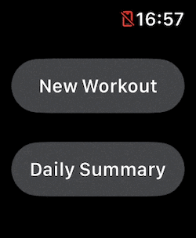
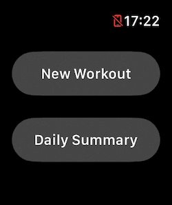

# Simple Workout App With HealthKit/SwiftUI

A workout app in WatchOS with HealthKit with the following capabilities.

1. Start/Pause/Resume/Finish New workout
    - Support adding sub-activities within the workout. Can be used for modeling multi-sports workout such as triathlon or interval training.
    - Display workout result including overall statistics and details for each individual sub-activities if there is any.
2. Obtain Daily result.
    - Workouts done for the given day
    - Activity summary displayed with Activity ring

For more details
1. [SwiftUI: Simple Workout App with HealthKit (Part 1)](https://medium.com/@itsuki.enjoy/swiftui-simple-workout-app-with-healthkit-part-1-793cd1cd6333)
2. [SwiftUI: Reading Data from HealthKit](https://medium.com/gitconnected/swiftui-reading-data-from-healthkit-5d2afc2b48a5)
3. [SwiftUI: Dividing Workout into SubActivities](https://medium.com/@itsuki.enjoy/swiftui-dividing-workout-into-subactivities-cda913f1ffa8)

